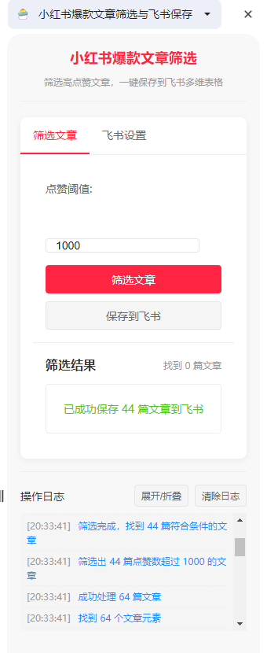

# 小红书爆款文章筛选与飞书保存 Chrome扩展
# 小红书爆款文章筛选与飞书保存 Chrome扩展 

[](https://github.com/yourname/XHS-Feishu-Saver/releases)
[](https://developer.chrome.com/docs/extensions/mv3/)
[](https://open.feishu.cn/)

<p align="center">
  
  <br>插件操作界面预览
</p>

## 🌟 功能特性
这是一个Chrome浏览器扩展，专为内容运营人员设计，可以：
- 智能识别小红书博主主页的爆款文章
- 支持自定义点赞阈值筛选（支持万/千单位自动转换）
- 一键批量保存到飞书多维表格
- 实时操作日志记录与显示
- 自动滚动加载完整文章列表
- 支持飞书API配置管理

## 🚀 快速开始
### 安装步骤
1. 克隆仓库
```bash
git clone https://github.com/yourname/XHS-Feishu-Saver.git
```
2. Chrome加载扩展
- 打开Chrome浏览器，进入扩展管理页面（chrome://extensions/）
- 开启右上角的"开发者模式"
- 点击"加载已解压的扩展程序"
- 选择本扩展所在文件夹

### 基本使用
1. 访问任意小红书博主主页
2. 点击Chrome工具栏中的扩展图标，打开侧边栏
3. 在侧边栏中设置点赞阈值（默认为1000）
4. 点击"筛选文章"按钮，扩展将自动分析页面上的文章
5. 筛选结果会显示在下方列表中
6. 点击"保存到飞书"按钮，将筛选结果保存到指定的飞书多维表格

### 注意事项
- 小红书页面使用懒加载，需要滚动页面加载更多文章才能完整筛选
- 首次使用时需要配置飞书API信息（APP ID、App Secret、Base ID、Table ID）
- 扩展会在侧边栏底部显示操作日志，可用于排查问题

## 配置说明

### 飞书API配置
在侧边栏的"设置"面板中填入以下信息：
- APP ID: 需要在飞书开放平台创建应用并获取
- App Secret: 需要在飞书开放平台创建应用并获取
- Base ID: 需要在飞书多维表格中获取
- Table ID: 需要在飞书多维表格中获取

> **重要提示**：使用前请务必先在[飞书开放平台](https://open.feishu.cn/)创建自己的应用，并在多维表格中创建相应的表格，然后获取以上信息。这些信息是私密的，请勿共享给他人。


## 技术实现

### 开发构建
- 安装依赖
```bash
npm install
```

- 开发模式（观察文件变化）
```bash
npm run dev
```

- 生产打包
```bash
npm run build
```

### 文章识别策略
- 使用多级CSS选择器定位文章元素
- 实现备用选择器和通用选择器，确保在页面结构变化时仍能正确识别文章
- 对识别到的元素进行严格验证，防止误识别

### 文章链接提取方法
- 支持多种文章链接格式的提取
- 自动将相对路径转换为绝对路径
- 完善的错误处理机制

### 飞书API集成
- 使用飞书开放API保存数据
- 支持批量保存多个文章记录
- 链接字段使用对象格式，包含text和link属性

## 故障排除

### 常见问题
1. **无法识别文章**：尝试刷新页面，或滚动页面加载更多内容
2. **保存到飞书失败**：检查飞书API配置是否正确，网络连接是否正常
3. **点赞数解析错误**：请在侧边栏的日志区域查看详细错误信息

### 日志功能
- 侧边栏底部提供详细的操作日志
- 可展开/折叠日志区域
- 支持日志清除功能

## 隐私说明
- 本扩展只在小红书网站上运行内容脚本
- 不收集用户个人信息
- 只在用户明确操作时才发送数据到飞书
- 使用HTTPS进行所有API通信

## 🤝 参与贡献
欢迎提交Issue和PR！请遵循以下流程：
1. Fork 本仓库
2. 创建特性分支 (git checkout -b feature/awesome)
3. 提交修改 (git commit -m 'Add awesome feature')
4. 推送分支 (git push origin feature/awesome)
5. 新建Pull Request

## 📄 许可证
MIT License
